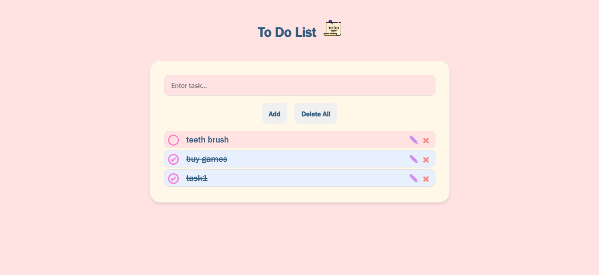
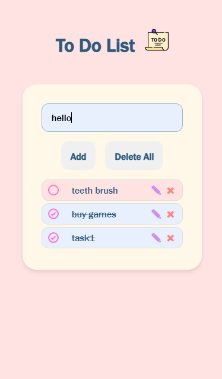

# To-Do List Application

A simple and visually appealing To-Do List web application that allows users to add, edit, delete, and mark tasks as completed. The application uses local storage to persist tasks, so your tasks remain even after refreshing the page.

## Live Site Link
[To Do List using Vanilla JS](https://todolist-js-vanilla.netlify.app/)

**Desktop View**

**Mobile View**

## Features

- **Add Tasks**: Easily add new tasks to your to-do list.
- **Edit Tasks**: Click the edit icon (✎) to modify existing tasks.
- **Delete Tasks**: Click the delete icon (×) to remove tasks.
- **Mark as Completed**: Click on a task to mark it as completed (strikethrough).
- **Delete All**: Clear the entire list with the "Delete All" button.
- **Responsive Design**: Works seamlessly on both desktop and mobile devices.
- **Local Storage**: Tasks are saved in the browser's local storage, so they persist even after closing the browser.

## Technologies Used

- **HTML**: Structure of the web page.
- **CSS**: Styling and visual design.
- **JavaScript**: Functionality and interactivity.
- **Local Storage**: Persistence of tasks.

## How to Use

1. **Add a Task**:
   - Enter a task in the input box and click the "Add" button.
   - The task will appear at the top of the list.

2. **Edit a Task**:
   - Click the edit icon (✎) next to the task you want to edit.
   - Modify the task in the input field and click "Save".

3. **Delete a Task**:
   - Click the delete icon (×) next to the task you want to remove.

4. **Mark a Task as Completed**:
   - Click on the task to toggle its completion status. Completed tasks will have a strikethrough and move to the bottom of the list.

5. **Delete All Tasks**:
   - Click the "Delete All" button to clear the entire list.

